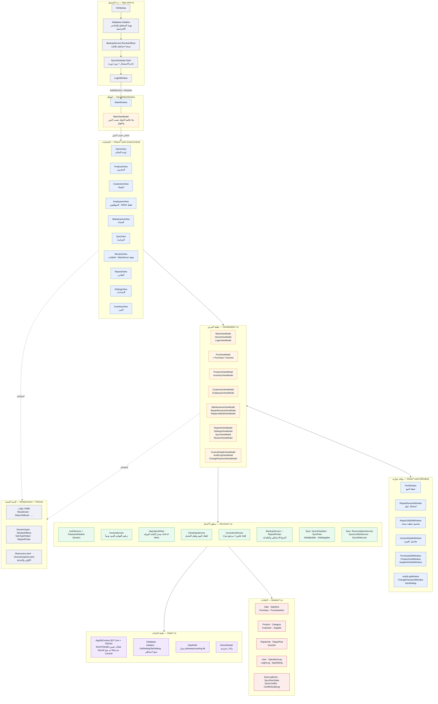
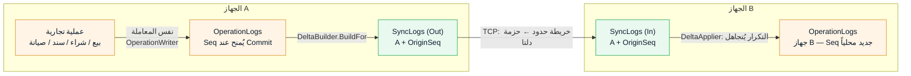
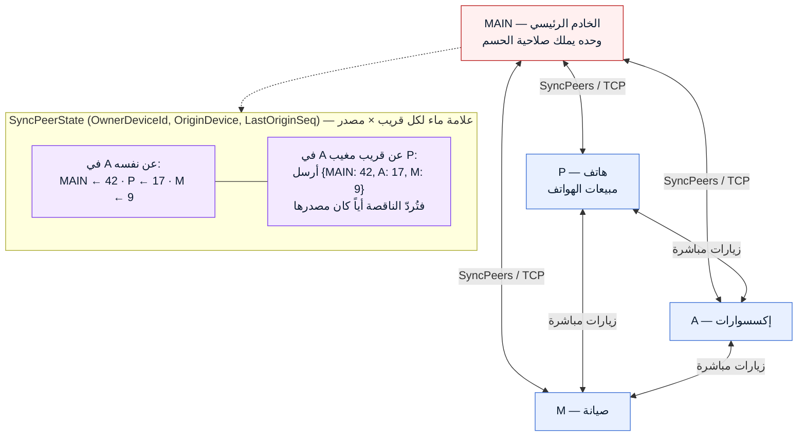
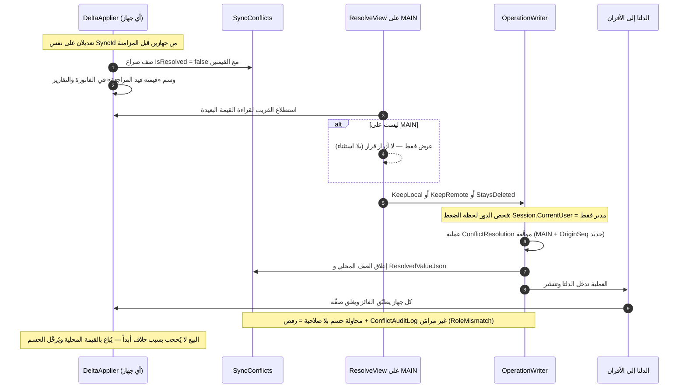
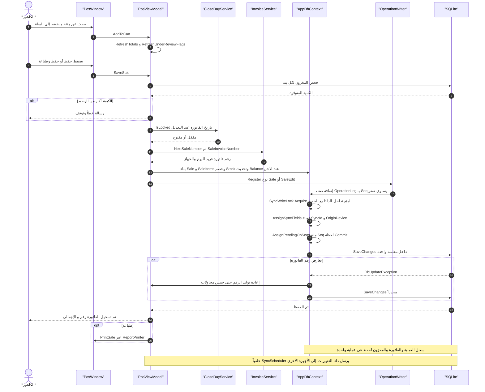
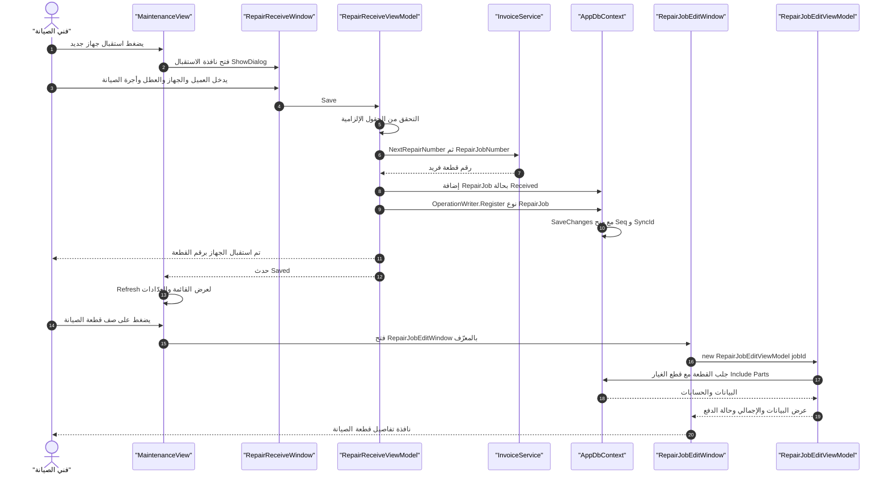
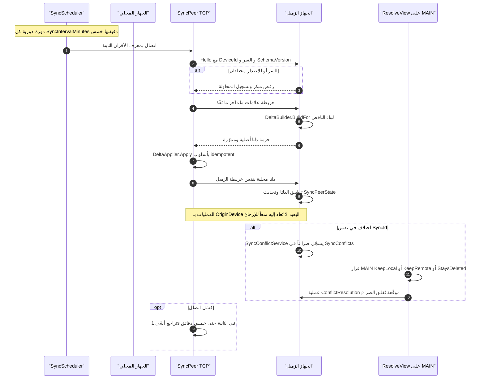

# مخططات المشروع — PhoneAccounting (casher1)

> **طبيعة هذا الملف:** مخططات **مكتوبة يدوياً من قراءة الكود** (لا مولَّدة آلياً) — آخر مراجعة ومطابقة مع قاعدة البيانات: **2026-09-26**.
> **المرجعية:** المرجع المعماري الوحيد للمزامنة هو [`SYNC-DESIGN.md`](SYNC-DESIGN.md)؛ ما في هذا الملف **مُبسَّط للتعارف** لا وثيقة سلوك.
> **حدود قراءة الأسهم:** الأسهم تقريبية في المعنى السلوكي — لا تُقرأ كوثيقة التزام. عند التعارض مع الكود: الكود ثم `SYNC-DESIGN.md`.
> **سياسة التحديث:** يُراجَع ويُعاد ضبط هذا الملف عند كل إصدار رئيسي؛ ولا يُعتمد بينها مخطط لا تُراجع مصادره.
> **خريطة تلقائية تكميلية:** https://gitdiagram.com/ar-kn/casher1 — مولَّدة آلياً من الغلاف، تُعاد توليدها عند كل إصدار رئيسي ولا تُعتمد بينها (تعارف فقط).

مخططات مرئية (Mermaid) لتوثيق بنية المشروع وقاعدة البيانات ومسارات العمليات.

**طريقة العرض:**
- على GitHub: تُعرض تلقائياً داخل صفحة Markdown.
- محلياً: إضافة `Mermaid` لامتدادات VS Code، أو https://mermaid.live لعرض/تصدير.

> جميع المخططات أدناه مبنية على مصدر المشروع الحالي (`App.xaml.cs`، `MainViewModel.cs`، `AppDbContext.cs`، `PosViewModel.cs`، `RepairReceiveViewModel.cs`، `Services/Sync/*`) ومُطابَقة على جداول SQLite الحقيقية (`PRAGMA table_info`).

---

## 1) المخطط المعماري — الطبقات والاعتمادات

**ملاحظات على الطبقة:**
- كل نافذة/شاشة تُنشئ ViewModel الخاص بها في `Code-Behind` ثم تُغلق بعد `ShowDialog()` وتُعيد تحميل القائمة (`Refresh()`).
- `PosWindow` تُفتح من `MainViewModel.OnSelectedItemChanged` عند اختيار «نقطة البيع» ثم تعود الشاشة إلى «لوحة التحكم».
- بوابات الصلاحيات: `الموظفون` ← `Role == Admin`، `الخلافات وقرارها` ← `Device == MainServer`.

---

## 2) مخطط قاعدة البيانات (ER)

**حقول المزامنة المشتركة** على كل الجداول التجارية (`Products`, `Customers`, `Sales`, `SaleItems`, `Purchases`, `PurchaseItems`, `RepairJobs`, `RepairParts`, `Vouchers`, `Users`, `Categories`, `Suppliers`):
`SyncId` · `OriginDevice` · `DeletedAt` (حذف ناعم) — تُملأ آلياً في `AppDbContext.SaveChanges`.

---

## 3) سجلّان لدوريتين مختلفتين — `OperationLogs` ↔ `SyncLogs`

قراءة شائعة خاطئة: الخطّين ليسا سجلاً واحداً. `OperationLogs` سجل الأعمال (ما حدث)، و`SyncLogs` إيصال نقل (ما خرج وما دخل).

| وجه المقارنة | `OperationLogs` — سجل العمليات | `SyncLogs` — سجل النقل (`SyncLogEntry`) |
|---|---|---|
| الدور | سجل الأعمال الدائم على هذا الجهاز | إيصال النقل: الحزم المرسلة والمستلمة |
| مصدر الحقيقة | **نعم** — منه تُبنى الدلتا | **لا** — أداة مساعدة، لا يُعتمد عليه لاستعادة الحالة |
| هوية السطر | `Seq` فريد تسلسلي يُمنح لحظة Commit داخل `AppDbContext.SaveChanges` | `(OriginDevice, OriginSeq)` — هوية العملية عبر الشبكة (§15.3) |
| التوقيت | `CommittedAt` (لحظة التنفيذ) | `CommittedAtUtc` + `SentAtUtc` / `ReceivedAtUtc` |
| الاتجاه | لا يوجد — العملية محضورة واحدة | `Direction` = Out (خارج) أو In (داخل) |
| هل يُزامَن؟ | **نعم** — مصدر `DeltaBuilder` للدلتا | **لا يُزامَن نفسه** — يبقى على جهازه ويُقرأ منه |
| مَن يكتبه | `OperationWriter.Register` داخل نفس معاملة الحفظ | `DeltaBuilder` عند الإرسال (Out)، `DeltaApplier` عند الاستلام (In) |
| دوري عبر الشبكة | يحمل `OriginDevice`/`OriginSeq` للتمييز بين المحلّي والمُستَلَم | `(OriginDevice, OriginSeq)` مفتاح idempotency — التكرار يُتجاهل |

---

## 4) طوبولوجيا الانتشارية وعلامات الماء (§15.1 / §15.2)

شبكة **متماثلة (Mesh)** لا نجمية: كل جهاز يزامن مباشرة مع أي زوج متاح، لا عبر MAIN حصراً — لأن MAIN قد يطفو. قائمة الأقران ثابتة في إعداد `SyncPeers` (`ip:port` مفصولة بفواصل)، والاكتشاف التكميلي بـ UDP Broadcast + نبض Heartbeat. كل زوج علامة ماء لكل **مصدر**، لا علامة واحدة عامة — وإلا لا يمكن معرفة ما أُخذ من أيّ قربي مغيب.

- عند `delta_request`: يُرسِل الجهاز خريطة حدوده `{المصدر: آخر Seq أعرفه}`، ويُردّ القريب **كل ما يتجاوزها أياً كان مصدرها** (أصلياته + المُمرَّر).
- جهاز يغيب أياماً يستلم العمليات التي فاتته من أول قريب يلتقيه، ثم يمرّرها لبقية الأقران.
- المصافحة قبل أي شيء: السرّ المشترك + `SchemaVersion` (اختلافه = رفض) + موافقة صريحة من MAIN لإقران جهاز جديد.
- سقف الرسالة `MAX_FRAME = 50MB`، وتراجع أسّي `1s × 2^n` + Jitter حتى 5 دقائق، ولا يُعلَّن فشل إلا بعد 5 محاولات.

---

## 5) دورة الخلاف والحسم (§3 / §15.8)

قواعد الجولة لا تغيّرت عن `SYNC-DESIGN.md`: الحسم **مركزي على MAIN فقط**، والإغلاق لا يقع إلا بعملية موقّعة لها `OriginSeq` (وسم بلا عملية يُتجاهل)، والقرار يعيش في السجل الدائم لا في جدول عرض.

---

## 6) المخططات التسلسلية (Sequence)

### 6.1 عملية البيع من نقطة البيع

### 6.2 استقبال جهاز صيانة وفتح تفاصيله

### 6.3 المزامنة بين الأجهزة (نظير لنظير عبر TCP)

---

## 7) مفتاح الرموز

| الرمز | المعنى |
|---|---|
| `\|\|--o{` | واحد إلى كثير (علاقة أب/تاجر إلزامية) |
| `ProductId مرجعي` | مرجع منطقي دون مفتاح خارجي معرَّف في EF |
| `Seq يُمنح عند Commit` | الترقيم يحدث داخل `AppDbContext.SaveChanges` لا عند الإنشاء |
| `DeletedAt` | حذف ناعم — الصف يبقى ويُستبعد من الاستعلامات |
| `SyncId + OriginDevice` | هوية الصف عبر الشبكة ومانع الإرجاع echo |

## 8) الملفات المرجعية

| المخطط | الملفات المرجعية |
|---|---|
| المعماري | `App.xaml.cs` · `ViewModels/MainViewModel.cs` · `Views/*` · `Services/*` |
| قاعدة البيانات | `Data/AppDbContext.cs` · `Models/*.cs` · `Data/Database.cs` |
| البيع | `ViewModels/PosViewModel.cs` (SaveSale) · `Services/InvoiceService.cs` · `Services/OperationWriter.cs` |
| الصيانة | `ViewModels/RepairReceiveViewModel.cs` · `ViewModels/RepairJobEditViewModel.cs` · `ViewModels/MaintenanceViewModel.cs` |
| المزامنة | `Services/Sync/SyncScheduler.cs` · `SyncPeer.cs` · `DeltaBuilder.cs` · `DeltaApplier.cs` · `docs/SYNC-DESIGN.md` |
| السجلّان | `Data/AppDbContext.cs` (Seq عند Commit) · `Services/OperationWriter.cs` · `Models/SyncLogEntry.cs` · `Services/Sync/DeltaBuilder.cs` |
| الانتشارية | `Models/SyncPeerState.cs` · إعداد `SyncPeers` · `docs/SYNC-DESIGN.md` §15.1–15.2 |
| الخلاف | `Services/Sync/SyncConflictService.cs` · `ViewModels/ResolveViewModel.cs` · `Models/SyncConflict.cs` · `docs/SYNC-DESIGN.md` §3 · §15.8 |
