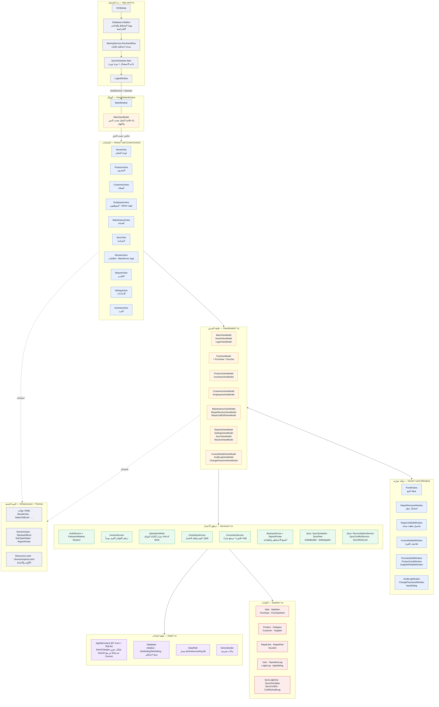
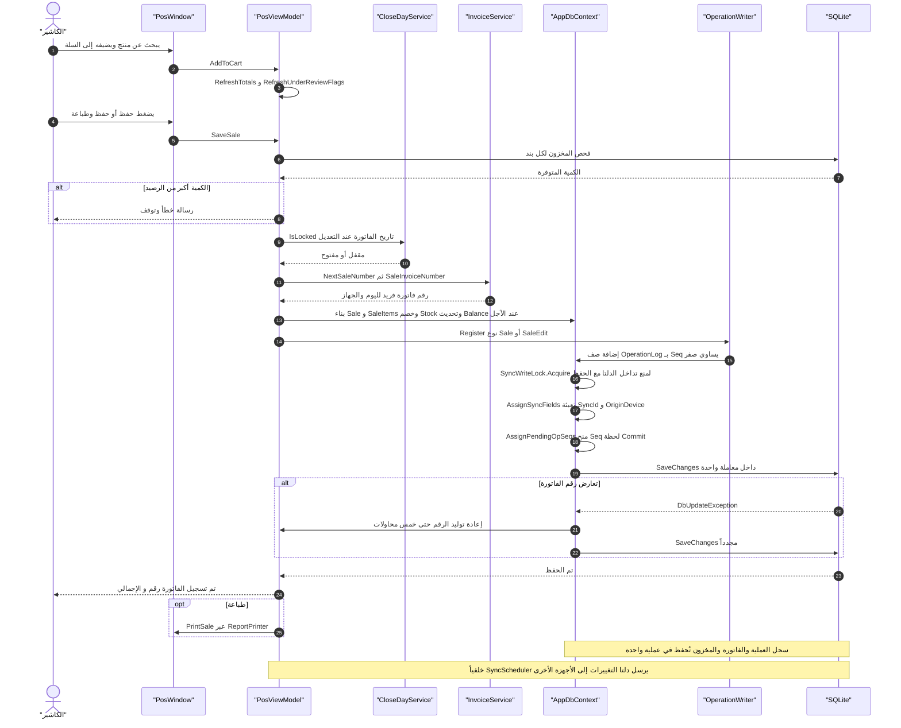
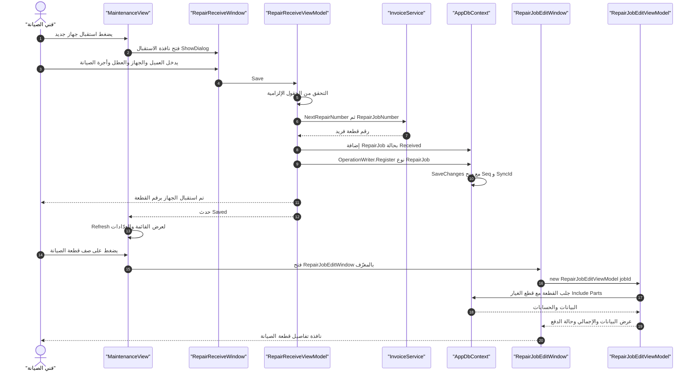
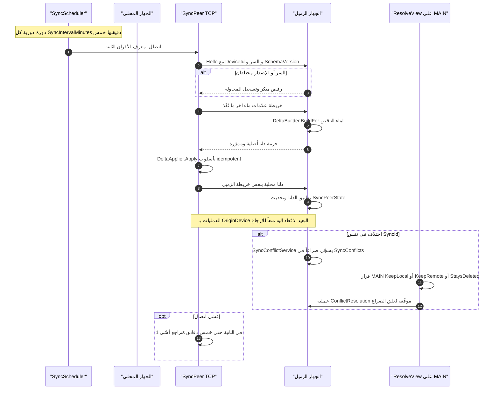

# مخططات المشروع — PhoneAccounting (casher1)

مخططات مرئية مولَّدة من الكود مباشرة (Mermaid) لتوثيق بنية المشروع وقاعدة البيانات ومسارات العمليات.

**طريقة العرض:**
- على GitHub: تُعرض تلقائياً داخل صفحة Markdown.
- محلياً: إضافة `Mermaid` لامتدادات VS Code، أو https://mermaid.live لعرض/تصدير.
- مخطط معماري تلقائي عبر https://gitdiagram.com/ar-kn/casher1

> جميع المخططات أدناه مبنية على مصدر المشروع الحالي (`App.xaml.cs`، `MainViewModel.cs`، `AppDbContext.cs`، `PosViewModel.cs`، `RepairReceiveViewModel.cs`، `Services/Sync/*`).

---

## 1) المخطط المعماري — الطبقات والاعتمادات

**ملاحظات على الطبقة:**
- كل نافذة/شاشة تُنشئ ViewModel الخاص بها في `Code-Behind` ثم تُغلق بعد `ShowDialog()` وتُعيد تحميل القائمة (`Refresh()`).
- `PosWindow` تُفتح من `MainViewModel.OnSelectedItemChanged` عند اختيار «نقطة البيع» ثم تعود الشاشة إلى «لوحة التحكم».
- بوابات الصلاحيات: `الموظفون` ← `Role == Admin`، `الخلافات وقرارها` ← `Device == MainServer`.

---

## 2) مخطط قاعدة البيانات (ER)

```mermaid
erDiagram
    Users ||--o{ Sales : "باع"
    Users ||--o{ Purchases : "اشترى"
    Users ||--o{ RepairJobs : "استلم"
    Users ||--o{ Vouchers : "سجّل"
    Users ||--o{ LoginLogs : "سجّل دخول"

    Customers ||--o{ Sales : "زبون له فواتير"
    Customers ||--o{ Vouchers : "سدّد ديناً"
    Suppliers ||--o{ Purchases : "مورّد"

    Sales ||--o{ SaleItems : "يتضمن"
    Purchases ||--o{ PurchaseItems : "يتضمن"
    RepairJobs ||--o{ RepairParts : "استُخدمت فيه"

    Categories ||--o{ Products : "تصنيف"
    Categories ||--o{ Categories : "ParentId"

    Products ||--o{ SaleItems : "ProductId مرجعي"
    Products ||--o{ PurchaseItems : "ProductId مرجعي"
    Products ||--o{ RepairParts : "ProductId مرجعي"

    Users {
        int Id PK
        string Username "unique"
        string PasswordHash "بلايين غير قابلة للاسترجاع"
        string DisplayName
        int Role "UserRole"
        bool IsActive
        bool MustChangePassword
        datetime CreatedAt
        datetime LastLoginAt
    }

    Customers {
        int Id PK
        string Name
        string Phone
        decimal Balance "الدين المستحق"
        datetime CreatedAt
    }

    Suppliers {
        int Id PK
        string Name
        string Phone
        decimal Balance "دين المورد"
    }

    Categories {
        int Id PK
        string Name
        int ParentId FK "تصنيف أب"
    }

    Products {
        int Id PK
        string Name
        string EnglishName
        int CategoryId FK
        string Barcode "فهرس"
        string Imei
        decimal BuyPrice
        decimal SellPrice
        int Stock "الرصيد"
        int MinStock
        bool IsActive
        int Device "DeviceRole"
    }

    Sales {
        int Id PK
        string InvoiceNumber "unique"
        datetime Date "فهرس"
        int UserId FK
        int CustomerId FK
        int PaymentMethod "نقدي/بطاقة/آجل"
        decimal Discount
        decimal Total
        decimal Profit
        string SyncId "لمزامنة"
        string OriginDevice
    }

    SaleItems {
        int Id PK
        int SaleId FK
        int ProductId
        string ProductName
        string Imei "IMEI مثبّت على الفاتورة"
        int Quantity
        decimal UnitPrice
        decimal BuyPrice
    }

    Purchases {
        int Id PK
        string InvoiceNumber "unique"
        datetime Date
        int UserId FK
        int SupplierId FK
        decimal Discount
        decimal Total
        string Note
    }

    PurchaseItems {
        int Id PK
        int PurchaseId FK
        int ProductId
        string ProductName
        int Quantity
        decimal UnitPrice
    }

    RepairJobs {
        int Id PK
        string JobNumber "unique"
        datetime ReceivedDate "فهرس"
        datetime CompletedDate
        datetime DeliveredDate
        string CustomerName
        string CustomerPhone
        string DeviceName
        string Issue
        string Notes
        int Status "Received/InProgress/Completed/Delivered"
        int UserId FK
        int Device "DeviceRole"
        decimal LaborFee
        int PaymentMethod
        bool IsPaid
        decimal PartsTotal
        decimal Total
    }

    RepairParts {
        int Id PK
        int RepairJobId FK
        int ProductId
        string ProductName
        int Quantity
        decimal UnitPrice
    }

    Vouchers {
        int Id PK
        string VoucherNumber "unique"
        datetime Date "فهرس"
        int CustomerId FK
        decimal Amount
        int PaymentMethod
        string Note
        int UserId FK
    }

    OperationLogs {
        long Id PK
        long Seq "يُمنح عند Commit فقط"
        string OpType "Sale/Void/Return/..."
        string EntityName
        int EntityId
        string DocumentNumber
        decimal Amount
        int UserId
        int DeviceRole
        datetime CommittedAt
        string OriginDevice "منع الإرجاع echo"
        long OriginSeq "هوية عبر الشبكة"
    }

    LoginLogs {
        int Id PK
        int UserId
        bool Success
        datetime At
    }

    AppSettings {
        int Id PK
        string Key "unique"
        string Value
    }

    SyncLogs {
        int Id PK
        string OriginDevice
        long OriginSeq "unique مع OriginDevice"
        int Direction
        datetime At
    }

    SyncPeerState {
        int Id PK
        string OwnerDeviceId
        string OriginDevice
        long LastAppliedSeq "علامة ماء آخر ما نُفّذ"
    }

    SyncConflicts {
        int Id PK
        string ConflictSyncId
        string EntityTable
        bool IsResolved
        int Resolution
    }

    ConflictAuditLogs {
        int Id PK
        string DeviceId
        datetime AttemptedAt
        string Action
    }
```

**حقول المزامنة المشتركة** على كل الجداول التجارية (`Products`, `Customers`, `Sales`, `SaleItems`, `Purchases`, `PurchaseItems`, `RepairJobs`, `RepairParts`, `Vouchers`, `Users`, `Categories`, `Suppliers`):
`SyncId` · `OriginDevice` · `DeletedAt` (حذف ناعم) — تُملأ آلياً في `AppDbContext.SaveChanges`.

---

## 3) المخططات التسلسلية (Sequence)

### 3.1 عملية البيع من نقطة البيع

### 3.2 استقبال جهاز صيانة وفتح تفاصيله

### 3.3 المزامنة بين الأجهزة (نظير لنظير عبر TCP)

---

## 4) مفتاح الرموز

| الرمز | المعنى |
|---|---|
| `\|\|--o{` | واحد إلى كثير (علاقة أب/تاجر إلزامية) |
| `ProductId مرجعي` | مرجع منطقي دون مفتاح خارجي معرَّف في EF |
| `Seq يُمنح عند Commit` | الترقيم يحدث داخل `AppDbContext.SaveChanges` لا عند الإنشاء |
| `DeletedAt` | حذف ناعم — الصف يبقى ويُستبعد من الاستعلامات |
| `SyncId + OriginDevice` | هوية الصف عبر الشبكة ومانع الإرجاع echo |

## 5) الملفات المرجعية

| المخطط | الملفات المرجعية |
|---|---|
| المعماري | `App.xaml.cs` · `ViewModels/MainViewModel.cs` · `Views/*` · `Services/*` |
| قاعدة البيانات | `Data/AppDbContext.cs` · `Models/*.cs` · `Data/Database.cs` |
| البيع | `ViewModels/PosViewModel.cs` (SaveSale) · `Services/InvoiceService.cs` · `Services/OperationWriter.cs` |
| الصيانة | `ViewModels/RepairReceiveViewModel.cs` · `ViewModels/RepairJobEditViewModel.cs` · `ViewModels/MaintenanceViewModel.cs` |
| المزامنة | `Services/Sync/SyncScheduler.cs` · `SyncPeer.cs` · `DeltaBuilder.cs` · `DeltaApplier.cs` · `docs/SYNC-DESIGN.md` |
